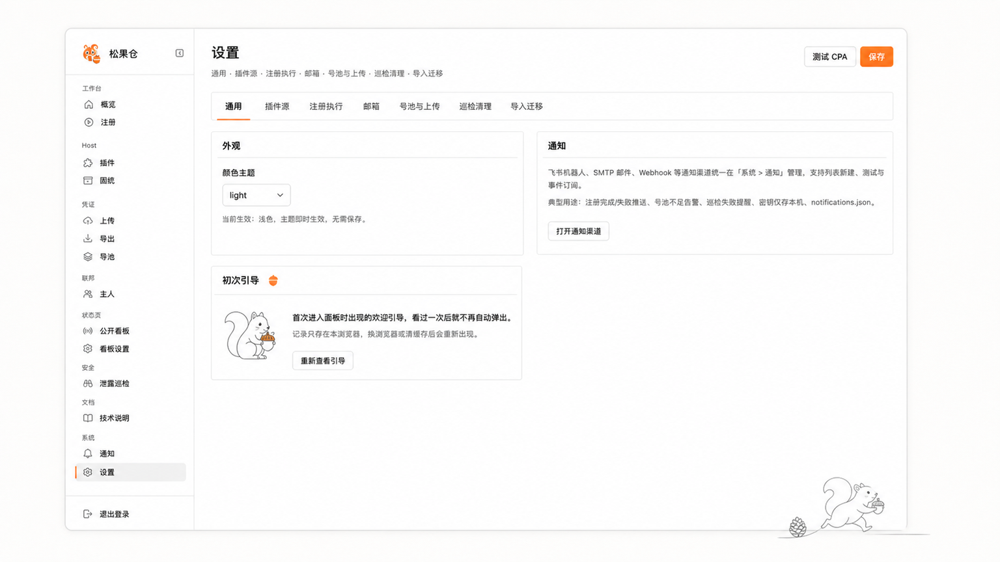
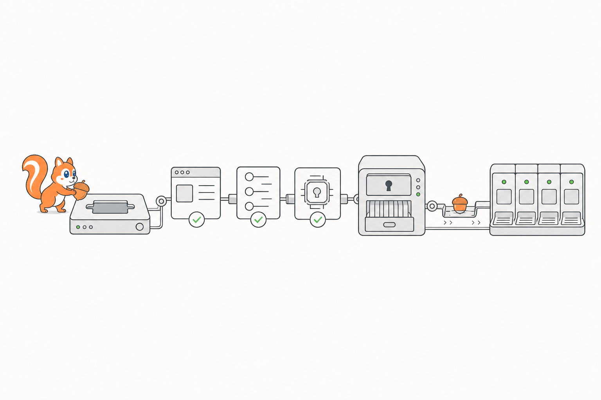
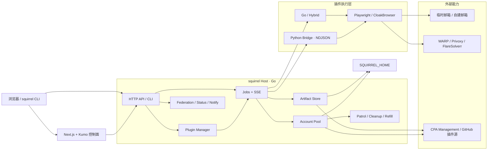
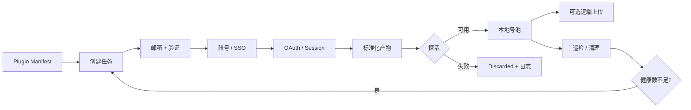
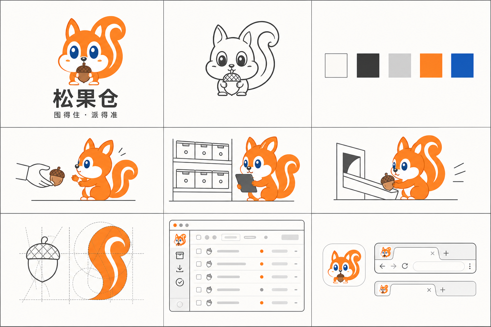

<p align="center">
  
</p>

<h1 align="center">松果仓</h1>

<p align="center">
  可插拔的账号、凭证与号池运行时
  <br />
  <strong>囤得住 · 派得准</strong>
</p>

<p align="center">
  <code>Go 1.26.5</code> · <code>Next.js 15</code> · <code>React 19</code> · <code>Docker Compose</code>
</p>



松果仓把账号注册、OAuth、凭证整理、批量迁移、号池巡检、自动补号与多节点调度放进同一个宿主。Host 负责插件、任务、产物和状态；具体平台流程由 Go、Python Bridge 或 Hybrid 插件执行。

它不是又一套散落的注册脚本。它提供统一的控制面、运行时和存储边界，让每一份凭证都有来源、状态与最终去向。

## 核心能力



| 能力 | 说明 |
|---|---|
| 插件运行时 | 发现、安装、启停和运行 Registrar / Pool 插件；支持 Go、Bridge 与 Hybrid Runtime |
| 注册流水线 | 邮箱、Turnstile、账号注册、Device OAuth、CPA JSON、探活与可选上传 |
| 凭证与号池 | 本地统一号池、批量上传/导出、状态分级、额度估算、清理与自动补号 |
| 任务与产物 | Worker Pool、SSE 实时进度、运行日志、Artifact Store 与可下载分卷 |
| 联邦调度 | Master / Slave 心跳、缺口分配、多主选择、公开状态页与模型探活 |
| 运维与安全 | 通知渠道、插件市场、配置迁移、隔离网络资产巡检与人工审批披露 |

## 立即使用

需要 Node.js 20+，支持 macOS arm64/amd64、Linux arm64/amd64 和 Windows amd64。无需克隆仓库，也无需预装 Go。

### 使用 npx（推荐）

先检查运行环境：

```bash
npx --yes @talex-touch/squirrel@latest doctor
```

启动本地 Web 管理器：

```bash
npx --yes @talex-touch/squirrel@latest
```

浏览器访问 <http://127.0.0.1:8787>。无参数命令等同于 `web`；需要显式指定时可执行：

```bash
npx --yes @talex-touch/squirrel@latest web
```

首次运行时，npm 启动器会从对应版本的 [GitHub Release](https://github.com/TalexDreamSoul/touch-squirrel/releases) 下载当前平台的 Go Host，按 `checksums.txt` 校验 SHA-256 后缓存。后续启动会直接复用缓存，不会重复下载。

需要固定版本时，将 `latest` 替换为具体版本：

```bash
npx --yes @talex-touch/squirrel@0.2.4 doctor
```

### 安装功能插件

新环境默认不携带任何注册器、号池或 Bridge 插件：Host 只提供 Web 管理器、任务、产物、存储和插件运行时。

1. 启动 Web 管理器并打开「插件」。
2. 进入「插件市场」，同步 `TalexDreamSoul/touch-squirrel` 官方源。
3. 选择需要的插件，点击安装并按需启用。

插件安装到 `~/.touch-squirrel/plugins/`，可独立于 npm 启动器和 Host 更新。第三方插件属于可执行代码，只添加可信 GitHub 仓库；插件清单与运行时契约见 [Plugin IDL](docs/contracts/plugin-idl.md)。

### 全局安装

希望长期使用短命令时，可以全局安装：

```bash
npm install --global @talex-touch/squirrel
squirrel doctor
squirrel
```

更新到最新版：

```bash
npm update --global @talex-touch/squirrel
```

### 常用配置

| 环境变量 | 用途 | 默认值 |
|---|---|---|
| `SQUIRREL_HOME` | Host 数据、插件与产物目录 | `~/.touch-squirrel` |
| `SQUIRREL_CACHE_DIR` | npm 启动器的 Host 二进制缓存 | npm 用户缓存目录 |
| `SQUIRREL_BINARY` | 跳过下载，改用指定的本地 Host | 未设置 |
| `SQUIRREL_DOWNLOAD_TIMEOUT_MS` | GitHub Release 下载超时（毫秒） | `900000` |
| `PANEL_ADDR` | Web 管理器监听地址 | `127.0.0.1:8787` |
| `PANEL_TOKEN` | 为 Web 管理器启用 Token 鉴权 | 未设置 |

macOS / Linux 示例：

```bash
PANEL_ADDR=127.0.0.1:9797 SQUIRREL_HOME="$HOME/.touch-squirrel-dev" \
  npx --yes @talex-touch/squirrel@latest
```

Windows PowerShell 示例：

```powershell
$env:PANEL_ADDR = "127.0.0.1:9797"
$env:SQUIRREL_HOME = "$HOME/.touch-squirrel-dev"
npx --yes @talex-touch/squirrel@latest
```

### 从源码开发

需要 Docker/OrbStack 和 Go 1.26.5；首次构建会自动安装 `panel/` 依赖。

```bash
git clone https://github.com/TalexDreamSoul/touch-squirrel.git
cd touch-squirrel
make up
```

```bash
make status
make down
make down ALL=1   # 同时停止 panel 与 clearance
```

### Docker 全家桶

```bash
cp .env.example .env
# 修改 .env 中的 PANEL_TOKEN
docker compose up -d --build
```

Compose 会启动 WARP、Privoxy、FlareSolverr 和 Panel，数据写入 `grok-data` volume。服务器部署、反向代理和备份见 [DEPLOY.md](DEPLOY.md)。

> 不需要 Turnstile 时可执行 `SKIP_TURNSTILE=1 make up`。上传、导出和巡检仍可用，但注册 Mint 可能失败。

## 系统架构



Host 管生命周期，插件管业务动作。Bridge 插件通过 NDJSON 报告进度和产物；Host 统一负责取消、超时、日志、入库与展示。

## 一次任务如何入库



`TARGET` 只统计最终探活成功并写入产物目录的账号。远端上传失败不会抹掉本地成功结果。

## 内置插件

| 插件 | Runtime | 状态 | 作用 |
|---|---|---|---|
| `xai-accounts` | Hybrid | 可用 | xAI 注册、SSO、Device OAuth 与 CPA 产物 |
| `chatgpt-registrar` | Bridge | 可用 | reg-factory ChatGPT 注册流程 |
| `claude-registrar` | Bridge | 可用 | reg-factory Claude 注册流程 |
| `github-registrar` | Bridge | 可用 | GitHub + Outlook + 指纹浏览器流程 |
| `grok-http-registrar` | Bridge | 可用 | reg-factory HTTP Grok 流程 |
| `grok-panel-registrar` | Bridge | 可用 | grok-register-panel Bridge |
| `outlook-registrar` | Bridge | 可用 | Outlook 注册流程 |
| `tavily-registrar` | Go | Shell | Tavily 注册器壳层 |
| `tavily-pool` | Go | 可用 | Tavily Key 轮换、HTTP/MCP Proxy 与耗尽处理 |

第三方插件从 `Host → 插件` 管理。插件属于可执行代码，只添加可信 GitHub 仓库；契约见 [Plugin IDL](docs/contracts/plugin-idl.md)。

## 常用命令

```bash
squirrel                         # 启动 Web 管理器
squirrel web                    # 显式启动
squirrel doctor                 # 环境诊断
squirrel plugin list
squirrel run xai-accounts -t 10
squirrel start -t 10            # 兼容入口
squirrel status
squirrel logs -f
squirrel stop
squirrel upload
squirrel artifacts list
```

| 开发命令 | 用途 |
|---|---|
| `make up` | clearance + 宿主 Panel，或复用已有容器 |
| `make panel-ui` | 构建 Next.js 静态面板到 `web/out` |
| `make build` | 构建面板并编译 `bin/squirrel` |
| `make test` | 执行 `go test ./...` |
| `make docker-up` | 构建并启动完整 Compose 栈 |
| `make docker-rebuild` | 只重建 Panel 服务 |

## 数据目录

默认使用 `~/.touch-squirrel`；`SQUIRREL_HOME` 优先，`GROK_HOME` 与已有 `~/.grok` 仅用于兼容旧版本。

```text
~/.touch-squirrel/
├── config.env
├── accounts.db
├── enabled.json
├── artifacts/
├── plugins/
├── local-pool/
├── outputs/<run-id>/{SSO,CPA,discarded}/
├── exports/
├── logs/
├── notifications.json
├── hunter.json
└── state.json
```

目录与凭证应保持仅当前用户可读。CPA、OAuth Token、邮箱凭证和插件 Secret 不应进入 Git。

## 品牌 IP

松鼠不是装饰，它是“收货、盘点、入库、派发”这套产品心智的视觉角色。产品界面以白、石墨灰和少量松鼠橙为主；蓝色只保留为角色眼睛的身份特征。



造型不变量、色彩上限、文案语气与历史资产边界见 [品牌 IP 规范](design/brand/README.md)。

## 文档

- [部署与反向代理](DEPLOY.md)
- [完整操作手册](docs/manual/chapters/01-overview.md)
- [流水线说明](docs/manual/chapters/05-pipeline.md)
- [联邦调度](docs/manual/chapters/07-federation.md)
- [插件系统](docs/manual/chapters/08-plugins.md)
- [存储与凭证](docs/manual/chapters/09-storage.md)
- [故障排查](docs/manual/chapters/10-troubleshooting.md)
- [发布 npm 与 Host](docs/RELEASING.md)
- [品牌 IP 规范](design/brand/README.md)

## 安全边界

- 对外部署必须设置强 `PANEL_TOKEN`，并使用 HTTPS 反向代理。
- 联邦密钥、状态页密码与 Panel Token 是三个独立边界，不要复用。
- 插件、Bridge 脚本与浏览器自动化都具有执行能力，安装前检查来源和代码。
- 隔离网络巡检只应在已获授权的本地、内网或测试环境中使用。
- 删除、清理与披露动作应先使用 Dry Run 或人工审批流程。

## 开发

```bash
make test
make build

cd panel
npm run lint
npm run build
```

前端为 Next.js 15 + React 19 + Cloudflare Kumo；静态导出写入 `web/out`，再由 Go `embed.FS` 打进 `squirrel` 二进制。
